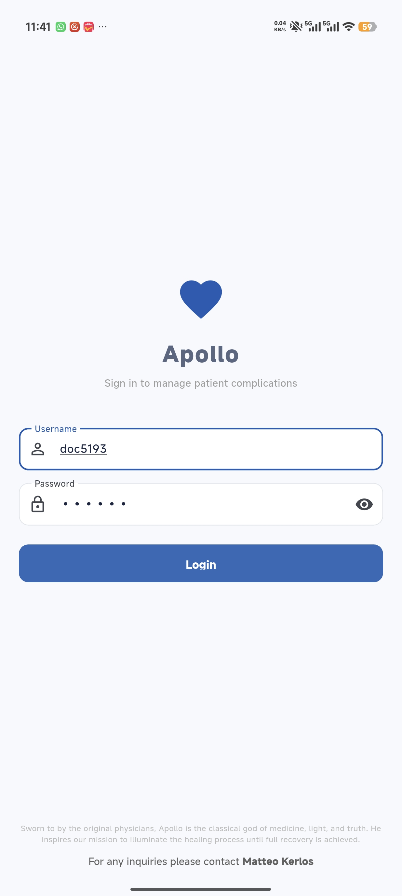
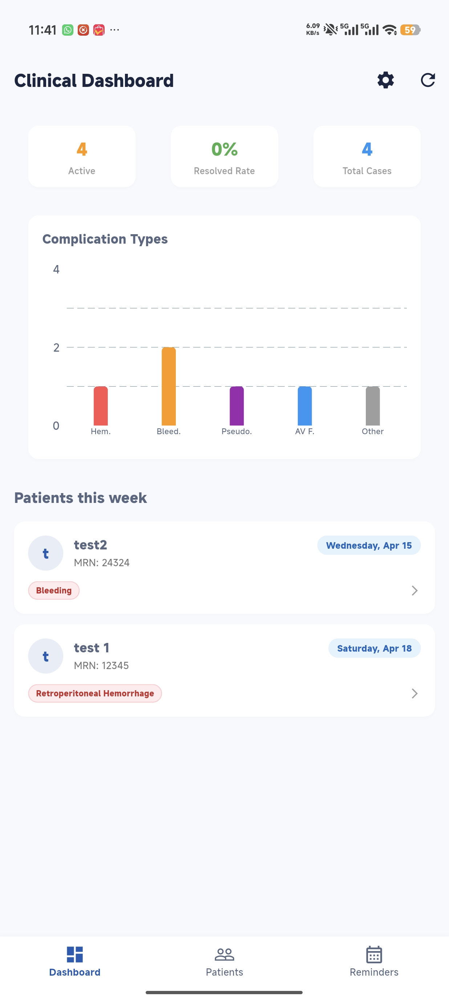
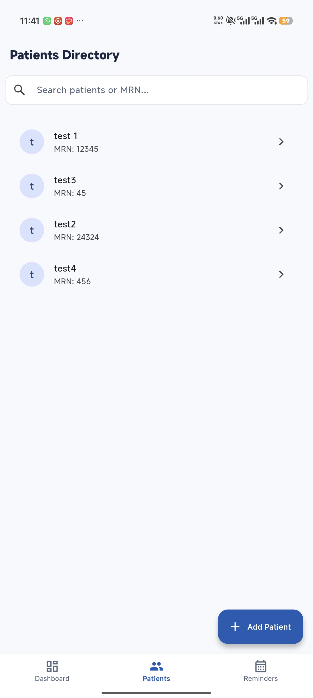
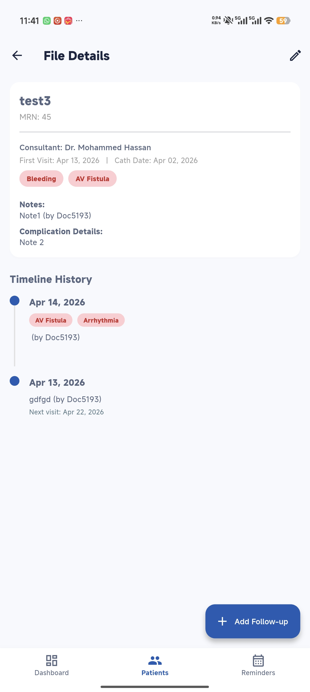

# Apollo
Apollo is a dedicated mobile application built to streamline the tracking of post-catheterization complications in the OPD.

    
   
   
  
  

### Core Clinical Features:

- Longitudinal Tracking: Monitor the progression of post-cath complications (hematomas, pseudoaneurysms, etc.) across multiple patient visits.

- Visual Documentation: Securely upload and review progressive images of the complication site directly within the patient's file.

- Automated Workflow: Built-in scheduling and daily dashboard reminders ensure no patient follow-up falls through the cracks until the complication is fully resolved.

**Matteo Kerlos**
